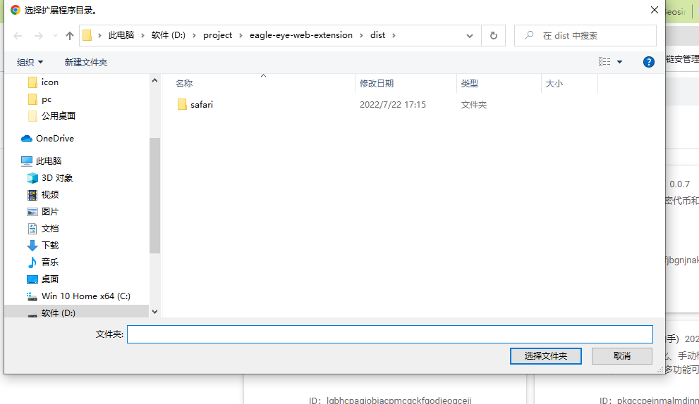

## 开发与打包指南

### 开发环境

### Chrome 插件

启动 指令 `chrome:dev`
它将基于`vite`和`gulp` 以`watch`模式运行`vite`的打包程序,
程序对`popup`、`background`、`content`、`manifest`进行打包，打包完成后，打包结果将存储在
根目录的`dist/chrome`中，然后在谷歌浏览器的扩展程序管理页面可以加载插件。

加载的路径就是`dist/chrome`

### Safari 插件

1.启动 指令 `safari:dev`
它将基于`vite`和`gulp`运行`vite`的打包程序,
程序对`popup`、`background`、`content`、`manifest`进行打包，打包完成后，打包结果将存储在
根目录的`dist/safari`中和目录`Beosin-Alert/Beosin-Alert Extension/Resources`中
其中`dist/safari`为中间产物，不需要管它，`Beosin-Alert/Beosin-Alert Extension/Resources`中的打包结果
是由`dist/safari`移动并改写而来的。

2.使用`mac`打开`xcode`编译器,编译器打开文件夹路径项目
`vite-web-extension/Beosin-Alert`
此时你可能在`xcode`中看不到`Beosin-Alert/Beosin-Alert Extension/Resources`下的打包产物`dist`文件夹,
那么你需要将 dist 文件夹手动引入  
`file` -》`add file to xxx` -》 选择 `Beosin-Alert/Beosin-Alert Extension/Resources`下的 dist  
手动引入后你可能会发现 `dist`文件夹在`Beosin-Alert`下而不在`Beosin-Alert/Beosin-Alert Extension/Resources`  
鼠标拖动到`Resources` 即可。  
3.然后点击`xcode`的构建按钮构建插件,插件构建完成后会自动注入到`Safari`浏览器中,
如果你发现插件不生效，请开启`Safari`浏览器的开发控制台,勾选'运行未签名的扩展',
然后在`Safari`的偏好设置-》扩展中勾选插件
